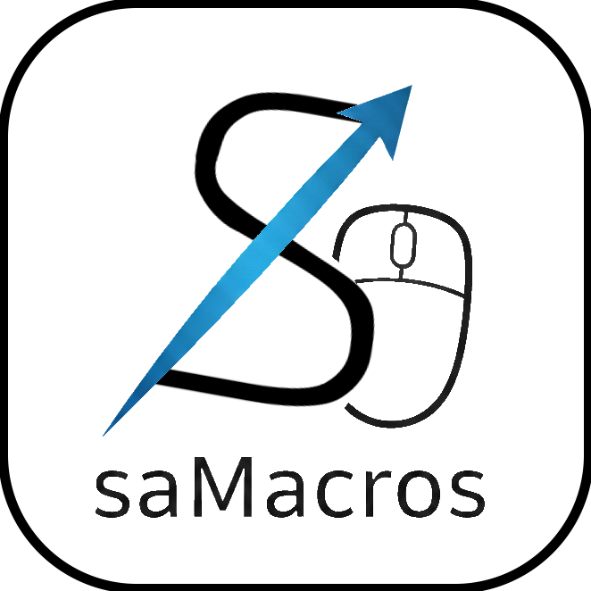

# saMacros

<p align="center">
  
  <br>
  <b>A High-Performance, Scriptable Automation Platform for Desktop.</b>
  <br>
  <i>The next-gen successor to saMacros, built for complexity.</i>
</p>

<p align="center">
  
  
  
  
  <br>
  
  <a href="https://github.com/Samera2022/saMacros/discussions"></a>
  <a href="https://deepwiki.com/Samera2022/saMacros"></a>
</p>

<div align="center">

| <sub>EN</sub> [English](README.md) | <sub>ZH</sub> [中文](docs/zh/README_ZH_CN.md) |
|--------------------------------------|---------------------------------------------|

</div>

## Preview
<p align="center">
  
<br>
  <sub style="font-size: 14px;"><i>The main interface of saMacros.</i></sub>
</p>

## Core Features

* **Advanced Scripting (GraalVM JS)**: Fully-featured JavaScript engine to create complex logic beyond simple recording.
* **Modernized UI**: A decoupled, high-performance interface based on FlatLaf, optimized for high-DPI displays.
* **Pause & Resume**: Intelligently pause macro execution at any point and resume without losing state.
* **Event-Driven Architecture**: Listen to system events and trigger custom scripts via our robust API.
* **Multi-Language Core**: Full support for 7+ languages (EN, ZH, JA, RU, KO, ES, FR) with a modular i18n system.
* **Smart Configuration**: High-decoupling settings registry for easy maintenance and extensibility.

## License
This project is licensed under the **Apache License 2.0**.
Compared to its predecessor, saMacros offers a more permissive environment for developers, script authors, and potential commercial integrations.

## Binary Integrity & Security
We take security seriously:
- **Sandbox Control**: Scripts requiring "Native Access" (File I/O, Network) are disabled by default and require manual user whitelisting.

## Getting Started

### Usage
<p align="center">
  
</p>

1. **Adjust**: The choose of language will determine the words in the frame, thus resulting in some buttons not being displayed in the frame.
   In this case, you will need to adjust the frame to the appropriate size.
2. **Configure**: Open the Settings dialog and Macros Settings dialog to set your preferred hotkeys. For detailed configuration docs, please refer to [Configuration](#configuration).
3. **Record**: Press your "Start Recording" hotkey or press this button in the frame and perform the actions.
4. **Save**: Use "Save Macros" to export your recording to a `.mmc` file.
5. **Replay**: Use "Load Macro" to load a `.mmc` file and press "Play Macro".

### Community & Support

- **Issues**: Report bugs or suggest features via GitHub Issues.

- **Forum**: Join our GitHub Discussions to share your scripts, report feedback, or discuss the next Snapshot.

## Extensibility via Scripting

saMacros features a powerful scripting system powered by GraalVM, allowing you to extend its functionality using JavaScript. You can listen to application events, interact with the core features, and create custom logic.

### How It Works

1.  **Create a Script**: Write a `.js` file and place it in the `scripts` folder inside your saMacros configuration directory (`%USERPROFILE%/AppData/saMacros/scripts`).
2.  **Define Metadata**: At the top of your script, define global variables to provide metadata. This is crucial for the application to manage your script correctly.

    ```javascript
    // ==UserScript==
    var display_name = "My Awesome Script";
    var register_name = "my_awesome_script"; // A unique, lowercase, snake_case identifier
    var author = "YourName"; // Single author only.
    var version = "1.0.0";
    var description = "This script does awesome things.";
    var available_version = "2.0.0~2.1.*"; // The compatible version of saMacros, supports wildcard syntax and range syntax.
    var hard_dependencies = ["another_script_name"]; // Scripts that MUST be enabled
    var soft_dependencies = []; // Optional scripts
    var requireNativeAccess = false; // For advanced (potential danger) functions, you have to to enable it.
    var requireNativeAccessDescription = "..."; // Your explanation for requesting Native Access. This will be displayed on warning frame. 
    // ==/UserScript==
    ```

3.  **Write Your Code**: Use the global `mm` object to interact with the application.

### Security and Native Access

For security, scripts run in a sandboxed environment with limited permissions. However, some scripts may require "native access" to perform advanced tasks (e.g., file I/O, running external processes).

-   **Requesting Access**: To request native access, add the following metadata to your script:
    ```javascript
    var requireNativeAccess = true;
    var requireNativeAccessDescription = "This script needs to read/write files to function.";
    ```
-   **User Approval**: When a script requiring native access is first loaded, it is **disabled by default**. The user must manually enable it through the `Settings > Scripts Manager`, where they will be shown a security warning.
-   **Whitelisting**: Upon approval, the user can choose to whitelist the specific script or the script's author, which is recorded in `white_list.json`. Whitelisted scripts/authors are automatically granted native access in the future.

### Script API Quick Reference

The API is exposed through the global `mm` object.

#### `mm` Object

| Method                               | Description                                                                                             |
| :----------------------------------- | :------------------------------------------------------------------------------------------------------ |
| `on(eventClassName, callback)`       | Registers a listener for a specific application event. The first argument is the full Java class name of the event. |
| `log(message)`                       | Prints a message to the application's log console.                                                      |
| `getContext()`                       | Returns the `ScriptContext` object for more advanced interactions.                                      |
| `cleanup()`                          | Unregisters all event listeners created by the script. This is called automatically when the script is disabled. |

#### `mm.getContext()` Object

| Method              | Description                                                              |
| :------------------ | :----------------------------------------------------------------------- |
| `simulate(action)`  | Simulates a mouse or keyboard action by calling the action's `perform()` method. |
| `getPixelColor(x,y)`| Gets the color of a pixel at the specified screen coordinates using Java Robot. Returns a `Color` object. |
| `showToast(t, m)`   | Displays a system tray notification with the given title and message. Falls back to console output if tray is not supported. |
| `getAppConfig()`    | Returns an `IConfig` object to read application settings (`getBoolean`, `getInt`, `getString`, etc.). |

### Example Script

This script logs a message to the console when the application starts and when a macro begins recording.

```javascript
// ==UserScript==
var display_name = "Hello World Script";
var register_name = "hello_world";
var author = "ScriptDeveloper";
var version = "1.0.0";
var description = "A simple example script.";
var available_version = "*"; // Compatible with all versions
// ==/UserScript==

// Listen for the application launch event
mm.on('io.github.samera2022.samacros.api.event.events.OnAppLaunchedEvent', function(event) {
    mm.log("Hello from 'Hello World Script'!");
    mm.log("App Version: " + event.getAppVersion());
});

// Listen for the event fired just before recording starts
mm.on('io.github.samera2022.samacros.api.event.events.BeforeRecordStartEvent', function(event) {
    mm.log("Recording is about to start at " + event.getStartTime());
});
```

## Development Document

### Local Documentation

For in-depth information, refer to the following local documents:

*   [Script Development Guide](docs/en/SCRIPT_DEVELOPMENT_GUIDE.md) - Comprehensive guide for writing and managing JavaScript scripts.
*   [Extended API Reference](docs/en/EXTENDED_API_REFERENCE.md) - Detailed reference for the saMacros API.
*   [API Analysis Report](docs/en/API_ANALYSIS_REPORT.md) - Insights into the API design and implementation.
*   [Development FAQ](docs/en/FAQ_EN.md) - Answers to frequently asked questions about development, versioning, and CI/CD.

### External Resources

*   For up-to-date documents, you can refer to [Samera2022/saMacros | DeepWiki](https://deepwiki.com/Samera2022/saMacros) or just click the badge at the top of the article. The website weekly updates this project's docs and provides a "Refresh this wiki" with "Enter email to refresh" button to force update the docs if it hasn't indexed yet.

### Author

**Developer: Samera2022**
* **GitHub**: [@Samera2022](https://github.com/Samera2022)
