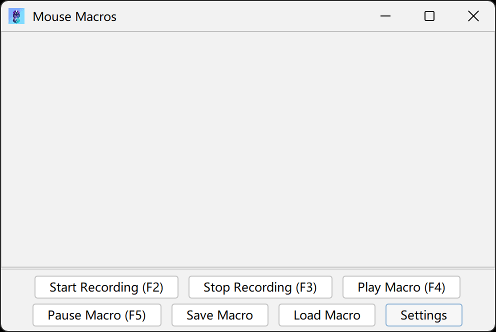
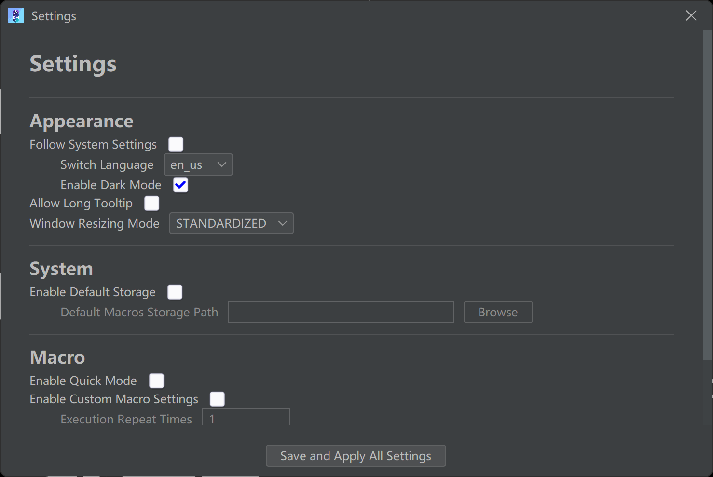

# saMacros

<p align="center">
  
  <br>
  <b>一款面向桌面的高性能、可脚本化自动化平台。</b>
  <br>
  <i>saMacros 的下一代继承者，专为复杂任务和速度而生。</i>
</p>

<p align="center">
  
  
  
  
  <br>
  
  <a href="https://github.com/Samera2022/saMacros/discussions"></a>
  <a href="https://deepwiki.com/Samera2022/saMacros"></a>
</p>

<div align="center">

| <sub>EN</sub> [English](../../README.md) | <sub>ZH</sub> [中文](README_ZH_CN.md) |
|------------------------------------------|------------------------------------------|

</div>

## 预览
<p align="center">
  
<br>
  <sub style="font-size: 14px;"><i>saMacros 主界面。</i></sub>
</p>

## 核心特性

* **高级脚本 (GraalJS)**：功能齐全的 JavaScript 引擎，用于创建超越简单录制的复杂逻辑。
* **现代化 UI**：基于 FlatLaf 的解耦、高性能界面，针对高 DPI 显示器进行了优化。
* **暂停与恢复**：智能暂停宏执行，并可在任意点恢复而不丢失状态。
* **事件驱动架构**：通过强大的 API 监听系统事件并触发自定义脚本。
* **多语言核心**：模块化国际化系统，全面支持 7 种以上语言（英、中、日、俄、韩、西、法）。
* **智能配置**：高解耦的设置注册表，易于维护和扩展。

## 许可证
本项目采用 **Apache License 2.0** 许可证。
与其前身相比，saMacros 为开发者、脚本作者和潜在的商业集成提供了更宽松的环境。

## 二进制完整性与安全性
我们非常重视安全性：
- **沙箱控制**：需要“原生访问”（文件 I/O、网络）的脚本默认禁用，需要用户手动将其加入白名单。

## 快速入门

### 使用方法
<p align="center">
  
</p>

1. **调整**：语言的选择将决定界面中的文字，从而导致某些按钮可能无法完整显示。在这种情况下，您需要将窗口调整至合适的尺寸。
2. **配置**：打开“设置”对话框和“宏设置”对话框来设置您偏好的热键。详细的配置文档请参考 [配置](#配置) 章节。
3. **录制**：按下您的“开始录制”热键或点击界面中的对应按钮，然后执行操作。
4. **保存**：使用“保存宏”将录制内容导出为 `.mmc` 文件。
5. **回放**：使用“加载宏”读取 `.mmc` 文件并按下“播放宏”。

### 社区与支持
- **Issues**：通过 GitHub Issues 报告 Bug 或建议功能。

- **论坛**：加入我们的 GitHub Discussions 分享您的脚本、反馈意见或讨论下一个快照版本。

## 通过脚本扩展

saMacros 拥有一个由 GraalVM 驱动的强大脚本系统，允许您使用 JavaScript 来扩展其功能。您可以监听应用程序事件、与核心功能交互以及创建自定义逻辑。

### 工作原理

1.  **创建脚本**：编写一个 `.js` 文件，并将其放入您的 saMacros 配置目录下的 `scripts` 文件夹中 (`%USERPROFILE%/AppData/saMacros/scripts`)。
2.  **定义元数据**：在脚本顶部，定义全局变量以提供元数据。这对于应用程序正确管理您的脚本至关重要。

    ```javascript
    // ==UserScript==
    var display_name = "我的超棒脚本";
    var register_name = "my_awesome_script"; // 一个唯一的、小写蛇形命名的标识符
    var author = "你的名字"; // 仅支持单一作者
    var version = "1.0.0";
    var description = "这个脚本能做一些很棒的事。";
    var available_version = "2.0.0"; // 兼容的 saMacros 版本，支持通配符写法和区间写法。
    var hard_dependencies = ["another_script_name"]; // 必须启用的脚本
    var soft_dependencies = []; // 可选脚本
    var requireNativeAccess = false; // 如果需要高级（潜在危险）的功能，则需将其设置为true。
    var requireNativeAccessDescription = "..."; // 向用户解释为什么该脚本需要原生访问权限。这将显示在警告窗口上。
    // ==/UserScript==
    ```

3.  **编写代码**：使用全局 `mm` 对象与应用程序进行交互。

### 安全性与原生访问

为安全起见，脚本在权限有限的沙箱环境中运行。但是，某些脚本可能需要“原生访问”权限来执行高级任务（例如，文件 I/O、运行外部进程）。

-   **请求访问**：要请求原生访问权限，请将以下元数据添加到您的脚本中：
    ```javascript
    var requireNativeAccess = true;
    var requireNativeAccessDescription = "此脚本需要读/写文件才能正常工作。";
    ```
-   **用户批准**：当首次加载需要原生访问权限的脚本时，它**默认是禁用的**。用户必须通过 `设置 > 脚本管理器` 手动启用它，届时会显示一个安全警告。
-   **白名单**：批准后，用户可以选择将特定脚本或脚本作者加入白名单，该信息记录在 `white_list.json` 中。已加入白名单的脚本/作者将来会自动获得原生访问权限。

### 脚本 API 快速参考

API 通过全局 `mm` 对象公开。

#### `mm` 对象

| 方法                               | 描述                                                                                             |
| :----------------------------------- | :------------------------------------------------------------------------------------------------------ |
| `on(eventClassName, callback)`       | 为特定应用程序事件注册一个监听器。第一个参数是事件的完整 Java 类名。 |
| `log(message)`                       | 将消息打印到应用程序的日志控制台。                                                      |
| `getContext()`                       | 返回 `ScriptContext` 对象以进行更高级的交互。                                      |
| `cleanup()`                          | 注销脚本创建的所有事件监听器。在脚本被禁用时自动调用。 |

#### `mm.getContext()` 对象

| 方法              | 描述                                                              |
| :------------------ | :----------------------------------------------------------------------- |
| `simulate(action)`  | 通过调用动作的 `perform()` 方法模拟鼠标或键盘操作。                    |
| `getPixelColor(x,y)`| 使用 Java Robot 获取指定屏幕坐标处像素的颜色。返回 `Color` 对象。 |
| `showToast(t, m)`   | 显示系统托盘通知，包含指定的标题和消息。如果不支持托盘，则回退到控制台输出。               |
| `getAppConfig()`    | 返回一个 `IConfig` 对象以读取应用程序设置（`getBoolean`、`getInt`、`getString` 等）。 |

### 示例脚本

此脚本在应用程序启动和宏开始录制时向控制台记录一条消息。

```javascript
// ==UserScript==
var display_name = "你好世界脚本";
var register_name = "hello_world";
var author = "ScriptDeveloper";
var version = "1.0.0";
var description = "一个简单的示例脚本。";
var available_version = "*"; // 兼容所有版本
// ==/UserScript==

// 监听应用程序启动事件
mm.on('io.github.samera2022.samacros.api.event.events.OnAppLaunchedEvent', function(event) {
    mm.log("来自'你好世界脚本'的问候！");
    mm.log("应用版本: " + event.getAppVersion());
});

// 监听录制开始前的事件
mm.on('io.github.samera2022.samacros.api.event.events.BeforeRecordStartEvent', function(event) {
    mm.log("录制即将在 " + event.getStartTime() + " 开始");
});
```

## 开发文档

### 本地文档

有关深入信息，请参阅以下本地文档：

*   [脚本开发指南](SCRIPT_DEVELOPMENT_GUIDE.md) - 编写和管理 JavaScript 脚本的综合指南。
*   [扩展 API 参考](EXTENDED_API_REFERENCE.md) - saMacros API 的详细参考。
*   [API 分析报告](API_ANALYSIS_REPORT.md) - 关于 API 设计和实现的见解。
*   [开发 FAQ](FAQ_ZH_CN.md) - 关于开发、版本控制和 CI/CD 的常见问题解答。

### 外部资源

*   如需查看最新的文档，请参考 [Samera2022/saMacros | DeepWiki](https://deepwiki.com/Samera2022/saMacros) 或点击页面顶部的徽章。该网站每周更新本项目文档，并提供“Refresh this wiki”按钮及邮件输入框，以便在未索引时强制更新。

### 作者

**开发者: Samera2022**
* **GitHub**: [@Samera2022](https://github.com/Samera2022)
